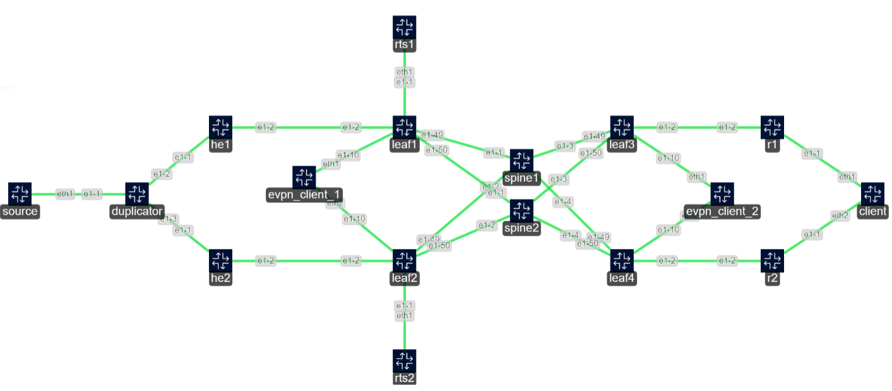

# Multicast Network Lab



## Lab Description

This network lab demonstrates a two-spine, four-leaf CLOS architecture. The underlay uses eBGP IPv6 unnumbered, and the overlay employs BGP-EVPN to deliver EVPN VXLAN services. Clients are configured with all-active EVPN L2 multi-homing.

A VRF-lite instance running PIM spans across leaves, spines, head-ends, R1, and R2. A multicast source on the far left sends traffic to group `234.0.0.1`.

### Encryption Servers (RTS1 & RTS2)

* Run in active-standby mode.
* Join multicast group `234.0.0.1` via IGMP.
* Encrypt received multicast traffic and re-source it into multicast group `238.0.0.1`.

### Dynamic Route Adjustment

Leaf1 and Leaf2 have event-handler scripts monitoring multicast ingress from RTS interfaces. When traffic exceeds a defined threshold, scripts dynamically install a static route with a lower metric, resulting in preferential routing of multicast traffic towards the active encryption server.

### Multicast Configuration

* Clients on the right join `238.0.0.1` using Source Specific Multicast (SSM) towards RTS1/RTS2.
* Original source-to-RTS traffic uses Any Source Multicast (ASM), with head-end 1 and 2 as Rendezvous Points (RPs).

## mcjoin Utility

`mcjoin` is a minimal CLI utility for simulating multicast sources and receivers.

### Supported Flags

* `-d` — Run as a background daemon
* `-s` — Run as multicast source (default acts as client)
* `-t` — Set TTL value
* `-i` — Specify network interface

> **Note:** Tested on Linux Kernel **6.8.0-59-generic**. Known IGMP-join issues exist with Kernel **5.x**.

### Usage Examples

#### Start as Source

```bash
mcjoin -s -t 20 -i eth1 234.0.0.1
```

Starts sourcing multicast traffic to group `234.0.0.1` on interface `eth1`.

#### Join Group (Any Source)

```bash
mcjoin -i eth1 234.0.0.1
```

Joins multicast group `234.0.0.1` on interface `eth1`, accepting traffic from any source.

#### Join Group (Specific Source)

```bash
mcjoin -i eth1 192.168.100.2,234.0.0.1
```

Joins multicast group `234.0.0.1` on interface `eth1`, specifically from source `192.168.100.2`.
